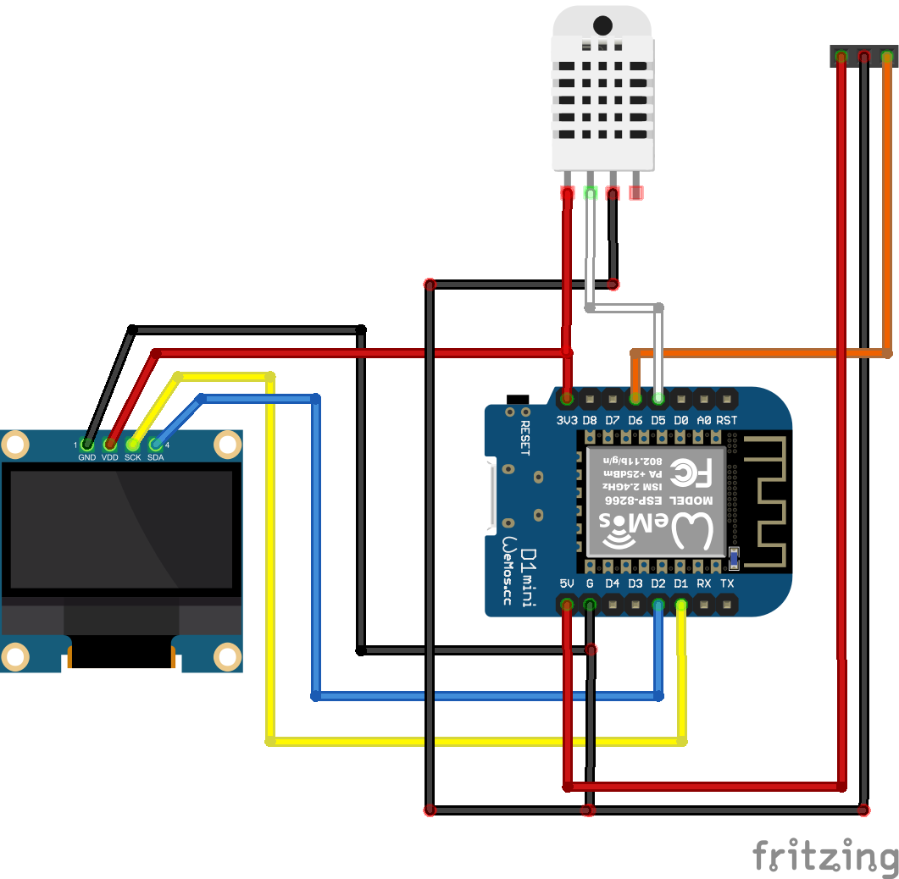

> This is a derivative of https://github.com/Hypfer/esp8266-vindriktning-particle-sensor with the following changes:
- OLED display (128x64 I2C)
- Temperature & humidity sensor (DHT22 on GPIO14 - D5)
- Particle sensor Rx moved from GPIO4 (D2) -> GPIO12 (D6)
- No WiFi

<h2>OLED Display and Temperature/Humidity for the Ikea VINDRIKTNING</h2>

This repository contains an ESP8266 firmware, which adds a display as well as a temperature/humidity sensor to the Ikea VINDRIKTNING PM2.5 air quality sensor.
The modification  doesn't interfere with normal operation of the device in any way.
The ESP8266 just adds another data sink beside the colored LEDs.

As the ESP8266 is 5V-tolerant, this should there shouldn't be any issues, however I haven't had time to test this for longer periods of time.
Therefore, if the ESP burns out after a while, just add a voltage divider or something.

## Videos
  

  

## Prerequisites

To extend your air quality sensor, you will need

- An ESP8266 with a 5v voltage regulator (e.g. a Wemos D1 Mini)
- Some short dupont cables
- A soldering iron
- A long PH0 Screwdriver (e.g. Wera 118022)

Fortunately, there is a lot of unused space in the enclosure, which is perfect for our ESP8266.
Also, everything we need is accessible via easy to solder testpoints.

## Hardware

To install the ESP8266, you need to unscrew the four visible screws in the back of the enclosure.

Then, there are also three screws holding the tiny PCB in place. These aren't necessary to remove since you can solder
in-place, however personally, I'd recommend taking the board out of there since it will be easier to solder without fear
of accidentally melting some plastic.

As you can see in this image, you'll need to solder wires to GND, 5V and the Testpoint that is connected to TX of the
Particle Sensor.

### Particle Sensor
For the particle sensor, just connect these Wires to GND, VIN (5V) and ~~D2~~ D6, which is GPIO12 (if you're using a Wemos D1 Mini).

### OLED Screen (128x64 I2C)
SCL -> D1 (GPIO5) and SDA -> D2 (GPIO4).

### Temperature/Humidity Sensor (DHT22)
Data -> D5 (GPIO14).

Done.

## Software

The firmware can be built and flashed using the Arduino IDE, but PlatformIO would be much easier because it will automatically pull in the libraries for you.

For Arduino IDE, you will need to rename the `*.cpp` file in `src/` to end in `.ino` instead of `.cpp` and add ESP8266 support to Arduino IDE by [using the Boards Manager](https://github.com/esp8266/Arduino#installing-with-boards-manager).

Furthermore, you will also need to install the following libraries using the Library Manager:

- olikraus/U8g2@^2.35.7
- adafruit/DHT sensor library@^1.4.6

Just build, flash, and you're done.

If you'd like to compile and upload this without a UI:  
`platformio run --target upload --upload-port /dev/ttyUSB0`

## Misc

To make soldering a bit easier, note that the whole outer metal part of the Micro USB connector of the D1 Mini is
connected to GND.

The Vindriktning consists of a custom(?) Cubic PM1006-like Sensor + another uC that does all that LED stuff, which talk
via UART. The uC simply regularly polls the sensor and displays the results.

As reported in #16, the transitions from Green to Yellow and Yellow to Red in the Ikea firmware are at around 30 and 100μg/m³.

## References and sources
- [Hypfer's Code](https://github.com/Hypfer/esp8266-vindriktning-particle-sensor)
- [@haxfleisch](https://twitter.com/haxfleisch) for their teardown of the device.
- [Gabriel Valky](https://github.com/gabonator) for the incredibly useful [LA104 custom firmware + tools](https://github.com/gabonator/LA104)

### 3D Models
- [Custom Back](https://www.thingiverse.com/thing:6403319)
- [OLED Frame](https://www.thingiverse.com/thing:2157801) (slides into case)
- [DHT22 Temperature/humidity Sensor Case](https://www.thingiverse.com/thing:1520129) (screws into back using one of the 4 frame-screws through the hole in the white part of the DHT22)
